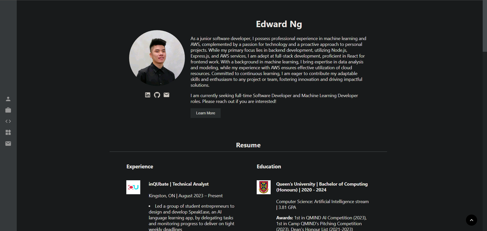
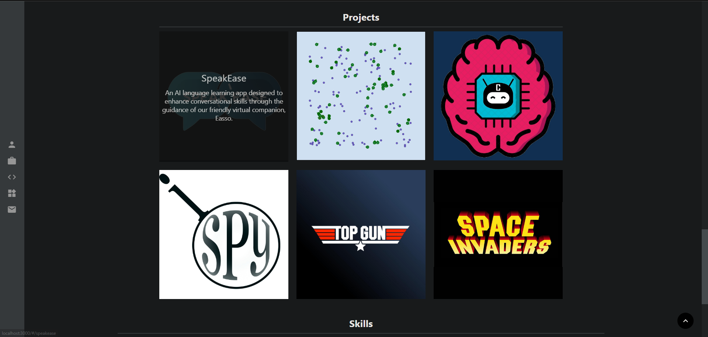

# My Personal Portfolio

This was my first attempt at creating a personal portfolio using React framework. On the website I listed my about me, experience, education, projects and skills. I used a Single-Page Application(SPA) implementation by routing to separate pages when
clicking on my projects and about me. I animated multiple components such as a scrolling effect when clicking a link, as well as fading images when hovering to view alt text.

Here are some screenshots:

 

 

### Run development app

In the project directory, you can run:

### `npm start`

Runs the app in the development mode.\
Open [http://localhost:3000](http://localhost:3000) to view it in your browser.
